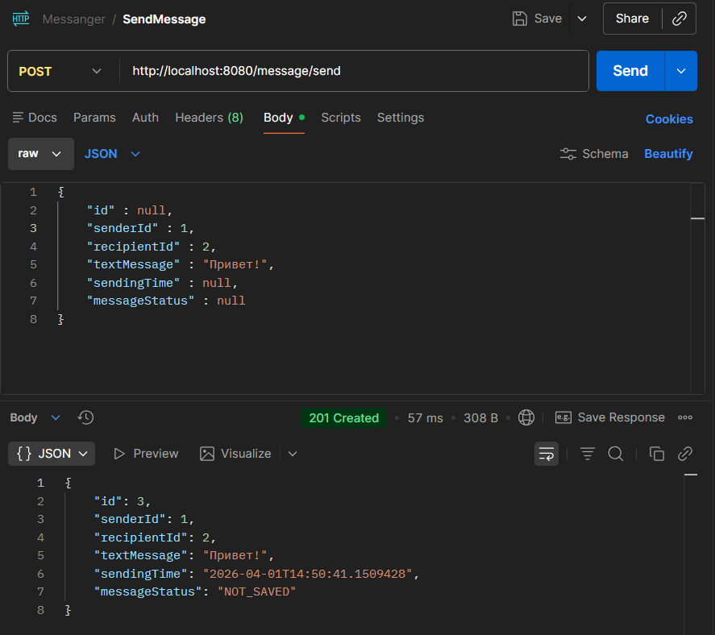
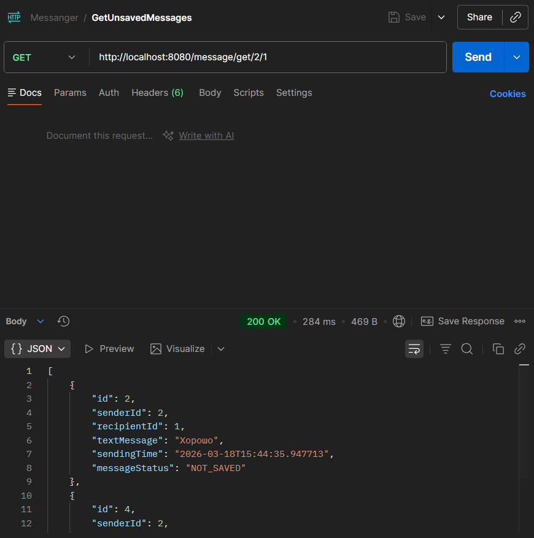
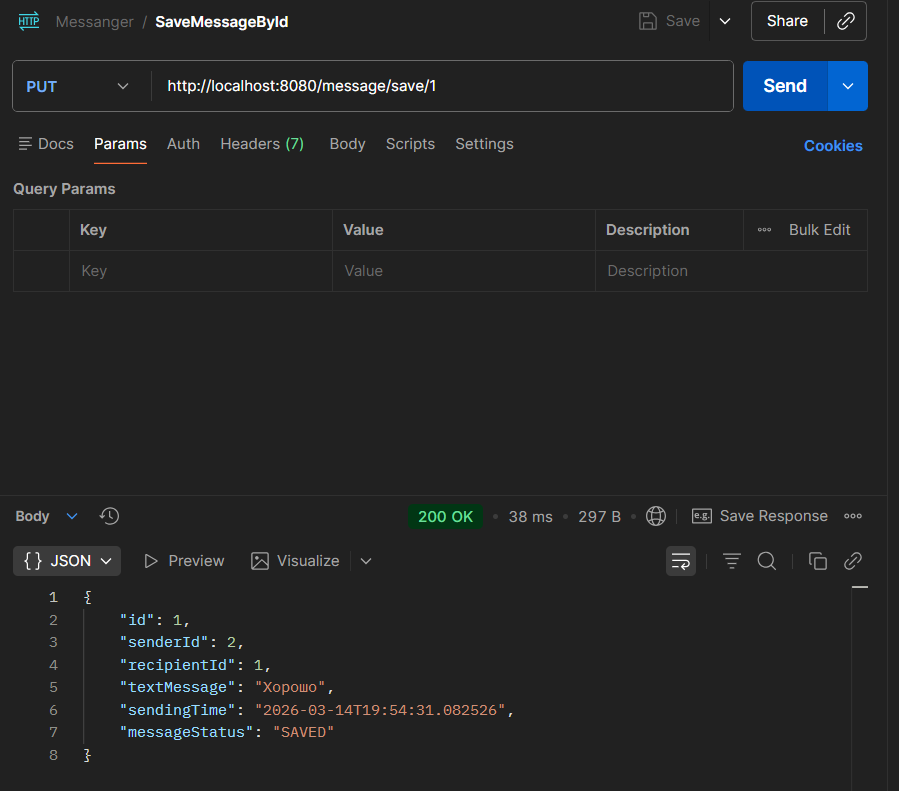
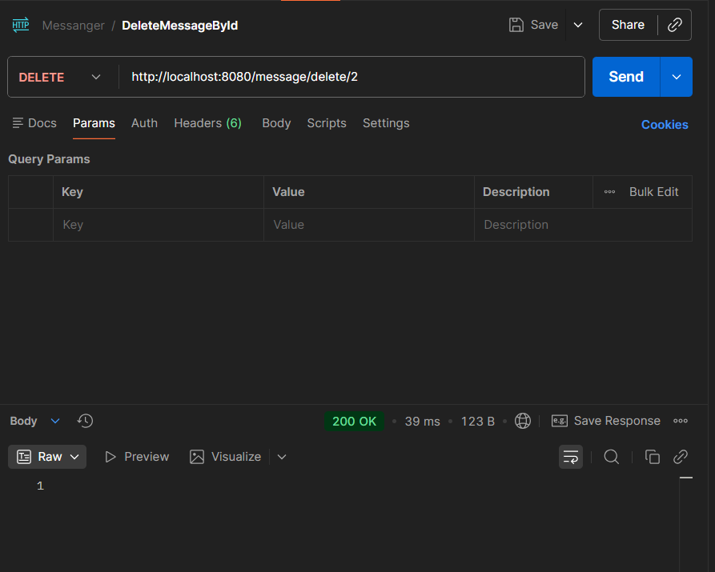
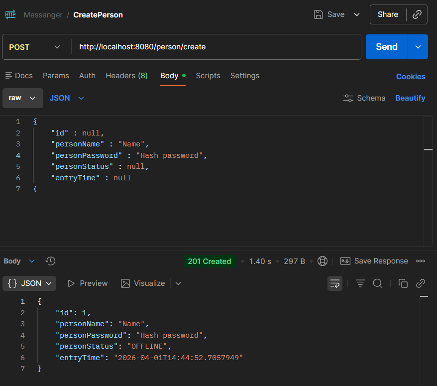
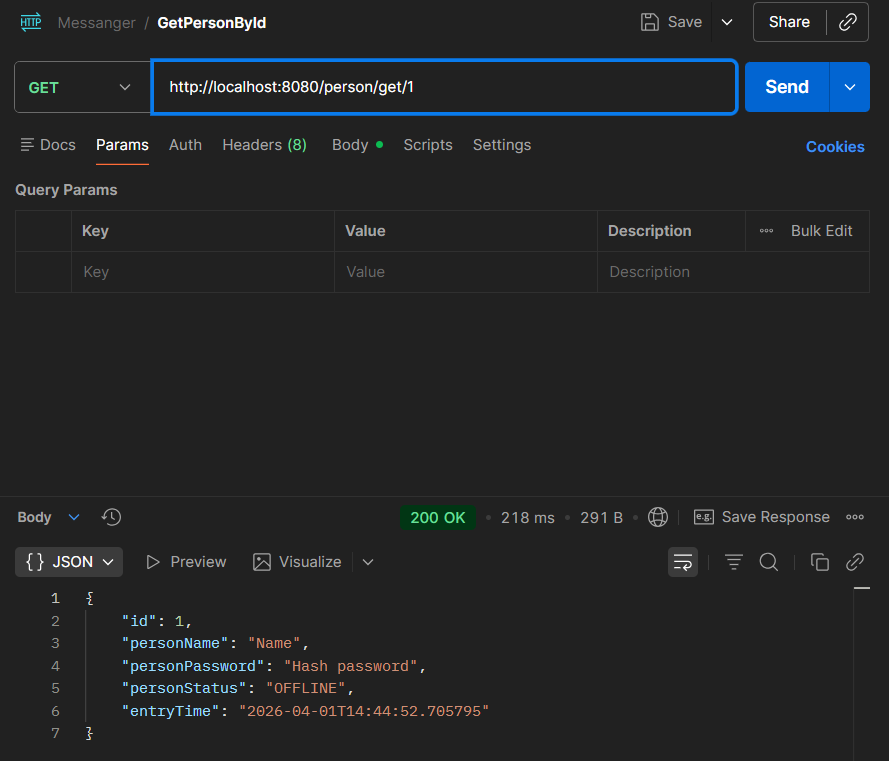
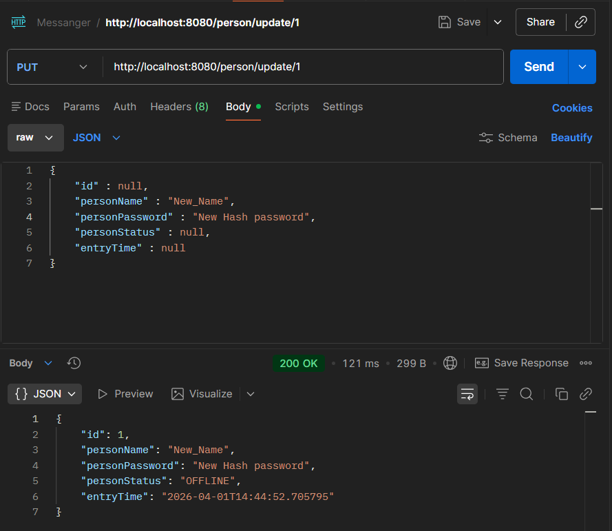
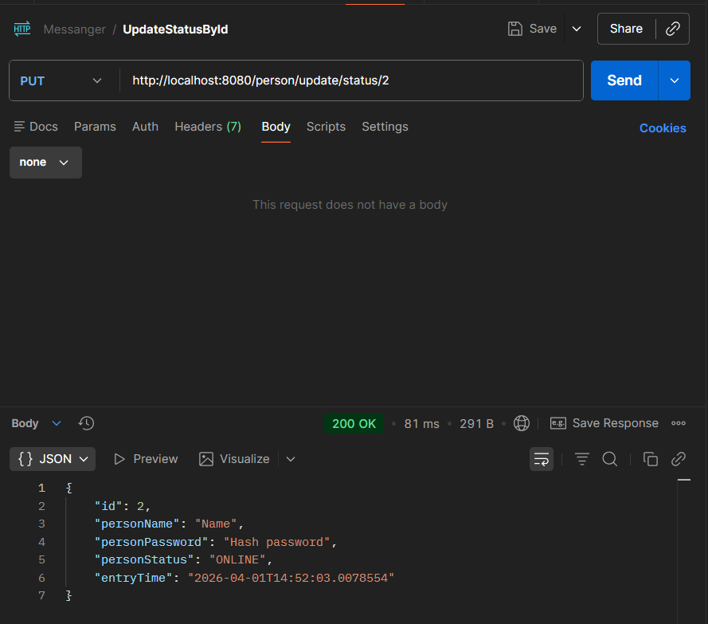
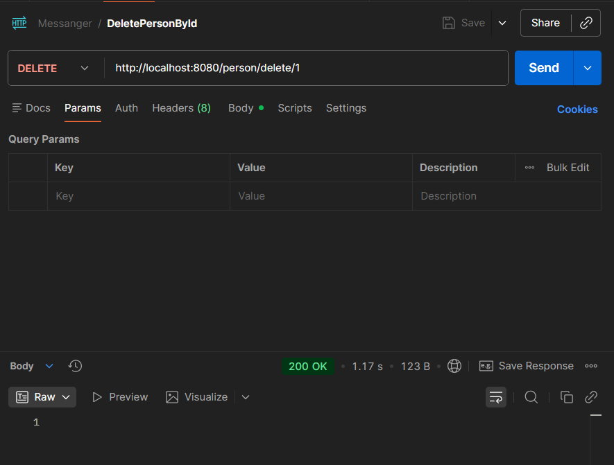

# Simple Messenger Server

REST API для мессенджера на Java Spring Boot.

## Технологии
- Java 21
- Spring Boot 3
- Spring Data JPA
- PostgreSQL
- Maven

## API Endpoints
### Message
- POST /message/send — отправить сообщение


- GET /message/get/{senderId}/{recipientId} — получить несохраненные сообщения


- PUT /message/save/{id} — изменить статус на "Сохраненное" по ID


- DELETE /message/delete/{id} — удалить сообщение по ID


### Person
- POST /person/create — создать пользователя


- GET /person/get/{id} — получить пользователя по ID


- PUT /person/update/{id} — обновить данные пользователя по ID


- PUT /person/update/status/{id} — обновить статус (онлайн/оффлайн) и время пользователя по ID


- DELETE /person/delete/{id} — удалить пользователя по ID


## Примеры запросов
  ### Создание пользователя
    POST /person/create
    ```json
    {
        "id" : null,   
        "personName" : "Name",
        "personPassword" : "рash_password",
        "personStatus" : null,
        "entryTime" : null
    }
  ### Отправка сообщения
    POST /message/send
    ```json
    {
        "id" : null,   
        "senderId" : 1,
        "recipientId" : 2,
        "textMessage" : "Привет!",
        "sendingTime" : null,
        "messageStatus" : null
    }

## Структура проекта
```
src/main/java/com/example/backendant/
├── BackendAntApplication.java
├── Message.java
├── MessageController.java
├── MessageEntity.java
├── MessageRepository.java
├── MessageService.java
├── MessageStatus.java
├── Person.java
├── PersonController.java
├── PersonEntity.java
├── PersonRepository.java
├── PersonService.java
└── PersonStatus.java
```

## База данных

Проект использует PostgreSQL.

### Настройка подключения
Файл `src/main/resources/application.properties`:
```properties
spring.datasource.url=jdbc:postgresql://localhost:5432/postgres
spring.datasource.username=postgres
spring.datasource.password=root
spring.jpa.hibernate.ddl-auto=update
```

## Запуск
```bash
git clone https://github.com/MikaAnt/simple-messenger-server.git
cd simple-messenger-server
mvn spring-boot:run
```

## Ссылка
https://github.com/MikaAnt/simple-messenger-server
